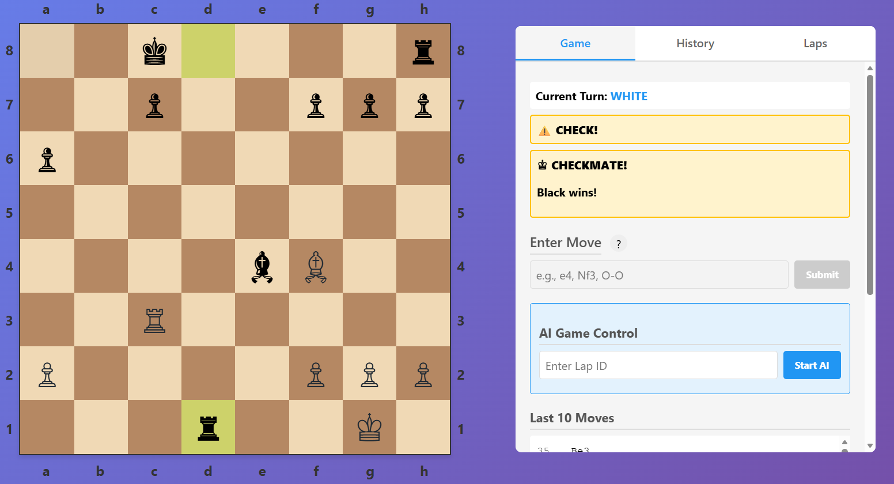

# Chess AI vs AI battle

## This project is a POC.

A comprehensive chess application featuring AI-powered players competing against each other, with a modern Angular UI
and Spring Boot backend.
The application uses OpenAI's GPT model to drive intelligent chess moves.
I was wondering how different GPT models would play chess against each other, so I created this project to explore that
idea.
The main interaction language for chess moves is algebraic notation for board state representation.

**The UI and java chess engine were vibe-coded!**

_Game streaming and replaying has implemented via Server Sent Events (SSE)._

Screenshots:


It has bugs and a lot of things to improve or experiments:

- use different GPT models (reasoning vs standard models, and so on)
- change system prompts
- change strategy for passing the current board state to the AI (full board vs only pieces positions, and so on)
- use standard chess engines (like Stockfish) instead of custom one

## Project Overview

This is a full-stack chess application with the following architecture:

- **Backend**: Spring Boot 3.5.8 REST API with MongoDB integration
- **Frontend**: Angular 21 standalone components with modern reactive patterns
- **AI Engine**: OpenAI GPT integration for move generation
- **Database**: MongoDB for storing game lapses and moves
- **Containerization**: Docker Compose for easy setup

## Quick Start

### Prerequisites

- **Java 21+** - Required for Spring Boot backend
- **Node.js v24.11.1+** for running Angular 21
- **MongoDB** - Can be run via Docker Compose
- **OpenAI API Key** - Required for AI functionality
- **Gradle** - Build tool (included via gradlew)

### Environment Setup

#### 1. Start MongoDB

```bash
cd docker-compose
docker-compose up -d
```

This will start a MongoDB instance at `mongodb://localhost:27017/chess-ai-battle`

#### 2. Configure Backend

Edit `chess-ai-battle/src/main/resources/application.yaml`:

```yaml
spring:
  data:
    mongodb:
      uri: mongodb://localhost:27017/chess-ai-battle
  ai:
    openai:
      api-key: ${SECRET_API_KEY}  # Set your OpenAI API key
```

Set the OpenAI API key environment variable depending on your OS. The environment variable name is `SECRET_API_KEY`.

## Running the Application

### Option 1: Run Both Services Separately

#### Backend (Spring Boot)

```bash
./gradlew bootRun
```

The backend will start at `http://localhost:8080`

#### Frontend (Angular)

```bash
# From project root or ui directory
# to run server locally development
gradlew :ui:ngServe

#or any other way if you have node/npm installed
```

The frontend will start at `http://localhost:4200`

## Using the Application

### Web UI (Angular)

1. Open your browser and navigate to `http://localhost:4200`
2. The main chess board will display with:
    - **Chess Board**: 8x8 board with pieces in starting positions
    - **Game Info Panel**: Displays current game state, captured pieces, and player turns
    - **Game Tabs**: Tabs for current game, move history, and saved games (laps)
    - **Help Modal**: Instructions on how to interact with the application

### Board Interaction

- **View Board**: The current chess position is displayed with both AI players' moves
- **Game Tabs**:
    - **Game Tab**: Active game display and controls
    - **History Tab**: Move history with algebraic notation
    - **Laps Tab**: Load and review saved games

### Features

- ✅ Real-time chess board updates
- ✅ AI vs AI gameplay using GPT models
- ✅ Move history tracking
- ✅ Save/load game lapses
- ✅ FEN (Forsyth-Edwards Notation) support
- ✅ Algebraic notation parsing
- ✅ Move validation
- ✅ Captured pieces display
- ✅ Check/Checkmate detection

## 📊 API Documentation

### Swagger/OpenAPI

The backend includes Swagger UI for API documentation:

**Access Swagger UI:**

```
http://localhost:8080/swagger-ui.html
```

### Main API Endpoints

#### Chess Board Endpoints

**Get Chess Board State**
It's used for debugging. For example, during the game, an error occurs, and the game is stopped. Identify the move
number and pass it along with lapId to the endpoint.
Ask copilot to help you fix the issue on frontend or/and backend side.

```
GET /api/v1/chessboards/laps/{lapId}/text
```

Query Parameters:

- `count` (optional): Number of moves to apply (default: all, -1 for unlimited)

Response: Plain text representation of the board

#### Game/Lap Management Endpoints

Access these through Swagger UI at `http://localhost:8080/swagger-ui.html`

Common operations:

- Create new game lapse
- Retrieve game history
- Update game state
- Get move history
- Manage saved games

### API Authentication

Currently, the API does not require authentication. All endpoints are publicly accessible.

## License

This project is licensed under the MIT License.

---

For more information or issues, please refer to the project's GitHub repository.


